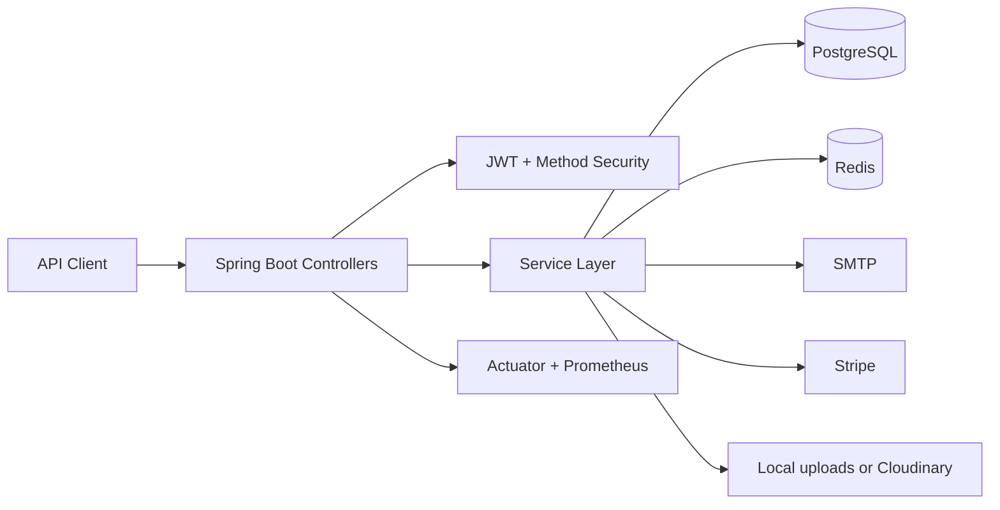

# E-Commerce API

Spring Boot backend for an e-commerce flow: auth, product catalog, cart, checkout, orders, wishlist, admin operations, Stripe webhooks, caching, and actuator health endpoints.

The browser UI has been removed. This repository is API-first.

## Stack

- Java 17
- Spring Boot 3.3.x
- Spring Security with JWT
- Spring Data JPA + Flyway
- PostgreSQL
- Redis cache
- Stripe checkout + webhooks
- OpenAPI / Swagger UI
- Testcontainers

## Architecture



## API Surface

Public endpoints:

- `GET /api/auth`
- `POST /api/auth/login`
- `POST /api/auth/register`
- `GET /api/auth/verify-email?token=...`
- `POST /api/auth/resend-verification?email=...`
- `GET /api/products`
- `GET /api/products/{productId}`
- `POST /api/stripe/webhook`

Authenticated endpoints:

- `GET /api/auth/me`
- `POST /api/products/{productId}/favorite`
- `GET /api/cart`
- `POST /api/cart/add`
- `PUT /api/cart/items/{cartItemId}`
- `DELETE /api/cart/items/{cartItemId}`
- `POST /api/cart/checkout`
- `GET /api/orders/me`
- `GET /api/orders/{id}`
- `GET /api/wishlist`
- `DELETE /api/wishlist/{wishListId}/items/{productId}`

Admin endpoints:

- `GET /api/admin/dashboard`
- `GET /api/admin/orders`
- `PATCH /api/admin/orders/{id}/status`
- `GET /api/admin/products`
- `POST /api/admin/products/add`
- `PUT /api/admin/products/{id}`
- `DELETE /api/admin/products/{id}`
- `GET /api/admin/users`
- `GET /api/admin/users/{id}`
- `PATCH /api/admin/users/{id}/status`
- `POST /api/admin/users/{id}/disable`
- `POST /api/admin/users/{id}/enable`
- `PATCH /api/admin/users/{id}/role`

Docs and observability:

- `GET /swagger-ui/index.html`
- `GET /v3/api-docs`
- `GET /actuator/health`
- `GET /actuator/health/liveness`
- `GET /actuator/health/readiness`

## Standard Responses

REST responses use the shared `ApiResponse<T>` envelope for predictable payloads. The Stripe webhook remains plain text by design. Errors are normalized through a single `ErrorResponse` structure with status and timestamp fields.

## Setup

Required environment variables:

- `DB_URL`
- `DB_USERNAME`
- `DB_PASSWORD`
- `JWT_SECRET`
- `STRIPE_SECRET_KEY`
- `STRIPE_WEBHOOK_SECRET`
- `CORS_ALLOWED_ORIGINS`
- `FRONTEND_URL`

Optional variables:

- `UPLOAD_DIR`
- `REDIS_HOST`
- `REDIS_PORT`
- `MAIL_USERNAME`
- `MAIL_PASSWORD`
- `MAIL_FROM`
- `ADMIN_USERNAME`
- `ADMIN_EMAIL`
- `ADMIN_PASSWORD`

## Run Locally

```bash
./mvnw test
./mvnw spring-boot:run
```

The test suite runs on H2. The integration test uses Testcontainers + PostgreSQL.

## Docker

```bash
docker compose up --build
```

Make sure the runtime environment provides the database and Redis variables expected by `application.properties`.

## API Examples

Login:

```bash
curl -X POST http://localhost:8080/api/auth/login \
  -H "Content-Type: application/json" \
  -d '{"username":"omar","password":"secret123"}'
```

Checkout:

```bash
curl -X POST http://localhost:8080/api/cart/checkout \
  -H "Authorization: Bearer <token>" \
  -H "Content-Type: application/json" \
  -d '{
    "customerName":"Omar",
    "customerEmail":"omar@example.com",
    "phone":"1234567890",
    "addressLine1":"Main Street",
    "city":"Kuwait City",
    "postalCode":"12345",
    "country":"Kuwait",
    "paymentMethod":"CASH_ON_DELIVERY",
    "idempotencyKey":"checkout-123"
  }'
```

## Deployment

- Provision PostgreSQL and Redis.
- Set all secrets through environment variables or platform secret storage.
- Expose only the actuator endpoints required by your platform checks.
- Keep `JWT_SECRET`, Stripe keys, and mail credentials out of the repository.
- Use a container image or platform buildpack that preserves the uploaded image directory.

## Production Considerations

- Auth, admin, and docs routes are secured by role-based security.
- Readiness and liveness endpoints are exposed through actuator health groups.
- Redis-backed caching is enabled and cache failures are logged instead of failing requests.
- Stripe webhooks are signature-validated and only accept `POST`.
- Product changes emit audit events.
- The repository still relies on a shared Redis cache and external SMTP provider, so those dependencies must be healthy for the full experience.

## Coverage and CI

- GitHub Actions runs Maven `verify`.
- JaCoCo coverage reports are generated under `target/site/jacoco`.
- The PostgreSQL repository integration test runs through Testcontainers.
